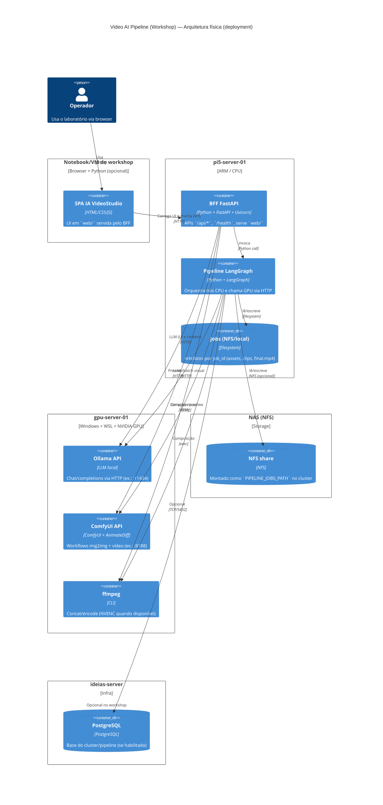
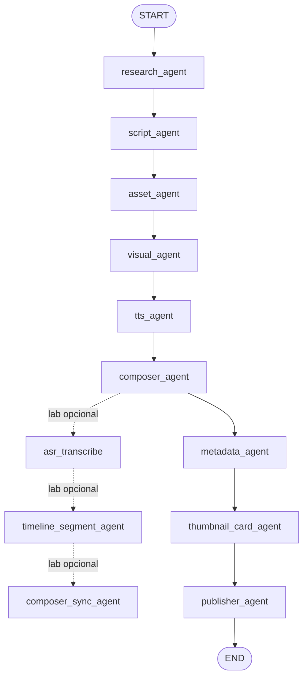
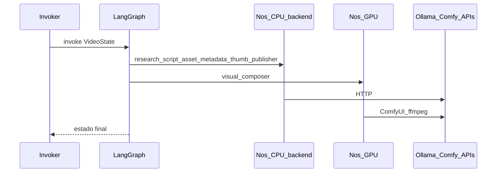

# Laboratório IA VideoStudio (Workshop)

[](https://www.python.org/)
[](https://github.com/dadosnapratica/tdc_summit_2026_video_ai_pipeline/issues)
[](https://github.com/dadosnapratica/tdc_summit_2026_video_ai_pipeline/stargazers)
[](https://github.com/dadosnapratica/tdc_summit_2026_video_ai_pipeline/commits/main)

Repositório canónico do material de evento: [github.com/dadosnapratica/tdc_summit_2026_video_ai_pipeline](https://github.com/dadosnapratica/tdc_summit_2026_video_ai_pipeline).

- **Issues**: [abrir / acompanhar](https://github.com/dadosnapratica/tdc_summit_2026_video_ai_pipeline/issues)
- **Configuração do workshop**: `docs/CONFIGURATION.md`
- **Arquitetura (workshop)**: `docs/ARCHITECTURE_WORKSHOP.md`
- **Arquitetura**: `docs/ARCHITECTURE_WORKSHOP.md`

Este diretório (`workshop/` no monorepo Ideias Factory) pode ser publicado como **raiz do repositório Git** do workshop: BFF FastAPI, SPA em `web/`, pacotes Python em `backend/` (CPU/ARM), `gpu/` (ComfyUI/ffmpeg), `arm/` (integrações de laboratório), e **`nas/`**: `nas/examples/` (fixtures didáticos versionados, ex. `01_scripts`…`09_*`) e `nas/jobs/` (saída de jobs do pipeline quando `PIPELINE_JOBS_PATH` aponta para aqui ou quando o fallback de `make_job_path` usa esta pasta). Em produção o NFS típico é `/mnt/nas/work/...` (ver `ARCHITECTURE.MD`).

## Layout

| Pasta | Conteúdo |
|-------|-----------|
| `backend/` | Estado (`VideoState`), `LLMGateway`, agentes de CPU/ARM (research, script, asset, TTS, metadata, publisher, thumbnail), providers de assets. |
| `gpu/` | `visual_agent`, `composer_agent`, cliente ComfyUI. |
| `nas/` | `examples/` — fixtures `01_*`…`09_*`; `jobs/` — artefactos por `job_id` (não versionar conteúdo). |
| `bff/` | FastAPI: APIs `/api/*`, estáticos `web/`, `/health`, OpenAPI em `/swagger`. |
| `web/` | SPA do laboratório. |
| `arm/` | Módulos Python do lab alinhados aos nomes dos agentes. |
| `docs/` | Documentação do workshop (arquitetura, diagramas, configuração, ADRs). |

Mapa detalhado: [`backend/ARCHITECTURE_MAP.md`](backend/ARCHITECTURE_MAP.md).

---

## Como correr o projeto

### Pré-requisitos

- Python 3.11+ recomendado.
- Dependências do laboratório: `pip install -r requirements.txt`
- Variáveis de ambiente: ver secção **Configuração** abaixo.

### Pipeline completo (CLI — produção / workshop)

O grafo do workshop está em `backend/core/pipeline.py`. (O CLI “completo” do monorepo pode ser diferente; aqui focamos no workshop/lab.)

### Laboratório web (BFF + SPA)

Na raiz do repo:

```bash
cp .env.example .env
python3 -m venv .venv
source .venv/bin/activate   # ou .venv\Scripts\activate no Windows
pip install -r requirements.txt
python3 -m uvicorn bff.lab_server:app --host 127.0.0.1 --port 8092
```

Abrir `http://127.0.0.1:8092`. Cliente HTTP: [`web/js/services.js`](web/js/services.js).

Detalhe das rotas e comportamento do laboratório: `docs/ARCHITECTURE_WORKSHOP.md`.

### Clone do repositório do workshop

Este repositório já tem `workshop/` como raiz; mantenha `PYTHONPATH` no diretório atual (raiz do repo).

---

## Configuração

| Documento | Conteúdo |
|-----------|----------|
| **[docs/CONFIGURATION.md](docs/CONFIGURATION.md)** | Ordem dos `.env`, onde está o `.env.example`, mapeamento de pastas do workshop e notas de deploy. |

**Ordem típica de carregamento pelo BFF:** `.env` na raiz do repo.

**Template canónico:** `.env.example` (na raiz).

## Segurança (importante)

- **Nunca commite** `.env`, tokens OAuth (`config/youtube_auth/*`) nem logs.
- O repo mantém apenas as pastas vazias `config/youtube_auth/` e `logs/` via `.gitkeep`.

---

## Deploy (visão geral)

| Cenário | Ideia |
|---------|--------|
| **Homelab** | Pipeline e/ou BFF tipicamente no **Pi** (orquestração + agentes CPU); **GPU** dedicada para Ollama, ComfyUI e ffmpeg/NVENC; artefactos em **NFS** (`PIPELINE_JOBS_PATH`). Rede conforme documentação em `docs/CONFIGURATION.md`. |
| **BFF noutro host** | Possível desde que haja rota HTTP até Ollama/ComfyUI e acesso de leitura/escrita aos paths de job (NFS montado ou equivalente). |
| **CI/CD** | Não obrigatório para o workshop; `cron` no Pi ou execução manual do CLI são o baseline descrito na arquitetura do projeto. |

ADRs sobre híbrido on‑prem + APIs: [docs/ARQUITETURA_ADRS.md](docs/ARQUITETURA_ADRS.md).

---

## Arquitetura (workshop)

Documentação para apresentação: **[docs/ARCHITECTURE_WORKSHOP.md](docs/ARCHITECTURE_WORKSHOP.md)** — camadas lógicas e físicas, grafo LangGraph, diagramas de sequência e **imagens PNG** em [docs/diagrams/](docs/diagrams/).

ADRs (Architecture Decision Records): **[docs/ARQUITETURA_ADRS.md](docs/ARQUITETURA_ADRS.md)**.

### Diagrama (alto nível)

```mermaid
flowchart LR
  U[Operador<br/>Browser (SPA)] -->|HTTP| BFF[FastAPI BFF<br/>`bff/lab_server.py`]
  BFF -->|invoca| LG[LangGraph pipeline<br/>`backend/core/pipeline.py`]

  subgraph CPU[CPU/ARM (backend)]
    A1[research/script/asset/tts/metadata/thumbnail/publisher]
  end

  subgraph GPU[GPU (gpu)]
    A2[visual/composer]
  end

  LG --> A1
  LG --> A2

  A1 -->|HTTP| O[Ollama API]
  A2 -->|HTTP| C[ComfyUI API]
  A2 -->|exec| F[ffmpeg]

  A1 -->|HTTP| S[Stock APIs<br/>Pexels/Pixabay/Unsplash/NASA/Wikimedia]
  A1 -->|HTTP| Y[YouTube Data API v3]

  BFF -->|jobs| NAS[`nas/` (jobs & examples)]
  LG -->|jobs| NAS
```

### Arquitetura física (C4 — Deployment)



**Mapa “módulo → node” (workshop/homelab):**

- **No node CPU/ARM (`pi5-server-01`)**
  - `backend/` (agentes CPU/ARM: research, script, asset, tts, metadata, thumbnail, publisher)
  - `bff/` (FastAPI BFF)
- **No node GPU (`gpu-server-01`)**
  - `gpu/` (clientes/agents que chamam ComfyUI e executam composição no host GPU quando aplicável)
  - Serviços externos: **Ollama**, **ComfyUI**, **ffmpeg**
- **Storage**
  - `nas/` (no repo: exemplos/fixtures; em execução: `jobs/` aponta para NFS/local via `PIPELINE_JOBS_PATH`)

### Frameworks e ferramentas principais

| Camada | Tecnologia | Onde | Uso |
|-------|------------|------|-----|
| Orquestração | **LangGraph** | `backend/core/pipeline.py` | Grafo do pipeline (estado → nós → estado). |
| API (BFF) | **FastAPI** | `bff/lab_server.py` | Endpoints `/api/*`, `/health`, OpenAPI (`/swagger`). |
| Servidor ASGI | **Uvicorn** | CLI | Executa o BFF localmente. |
| Schemas | **Pydantic** | `bff/api_schemas.py` | Modelos de request/response e OpenAPI. |
| LLM local | **Ollama** | externo | Research/script/metadata/curadoria (via HTTP). |
| Visual | **ComfyUI** (+ AnimateDiff) | externo | img2img + animação por cena (via HTTP). |
| Composição | **ffmpeg** | local | Concat de clipes + áudio; NVENC quando disponível. |
| Front-end | **HTML/CSS/JS** + **Chart.js** | `web/` | SPA do laboratório e gráficos (sem CDN). |

### Grafo do pipeline (ordem dos nós)

Alinhado a `backend/core/pipeline.py` e à aba **Fluxo** da SPA (grafo SVG em `web/index.html`).



**Etiquetas ARM/GPU na UI:** na aba Fluxo, cada nó indica o tier típico (CPU vs GPU) para o homelab; o código dos nós vive em `backend/agents/` (CPU) e `gpu/agents/` (GPU), não na pasta `arm/` (laboratório).

### Sequência — `invoke` do LangGraph (visão condensada)



Imagens exportadas (slides, PDF, offline): ficheiros `*.png` em [docs/diagrams/](docs/diagrams/).

---

## Git (repositório workshop)

Na pasta raiz do repo:

```bash
git init
git branch -M main
git remote add origin https://github.com/dadosnapratica/tdc_summit_2026_video_ai_pipeline.git
# … add, commit …
git push -u origin main
```

Use HTTPS ou SSH conforme a política da equipa.

---

## Validar configuração (`.env`)

Utilitário do pacote (paths, URLs, probes HTTP); não exige subir o BFF:

```bash
# cwd = raiz do repo
python -m backend.validate_config_cli
python -m backend.validate_config_cli --strict
```

O wrapper `scripts/validate_workshop_config.py` apenas delega para este módulo.

---

## Prompts e `config/`

Prompts por agente (`prompts/<agent>/*.txt`) ficam em `prompts/`. O carregador prefere `prompts/`. Ver [`backend/runtime_paths.py`](backend/runtime_paths.py).
