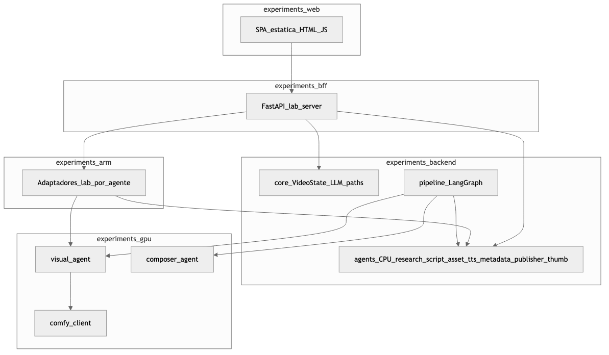
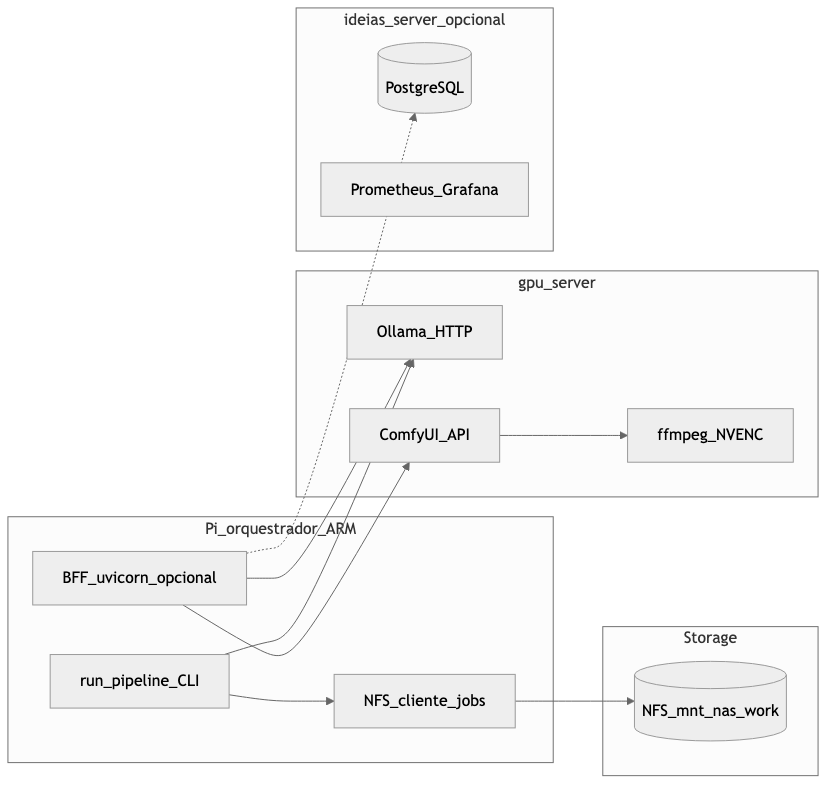
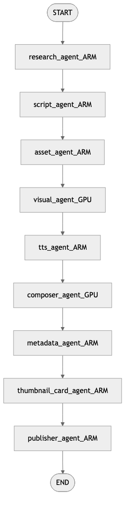
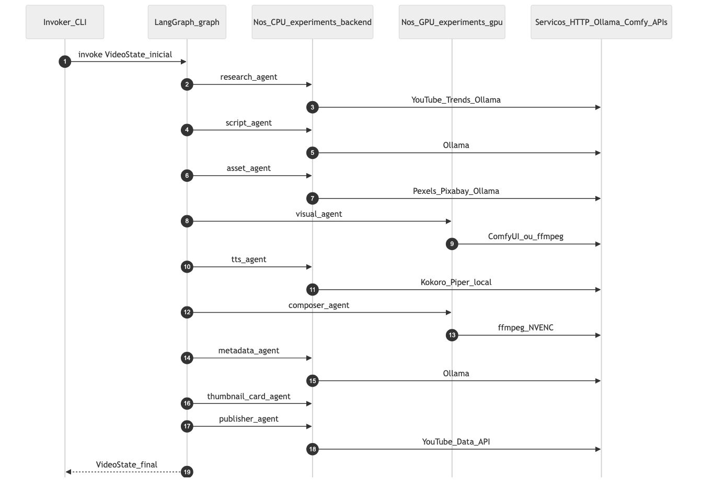
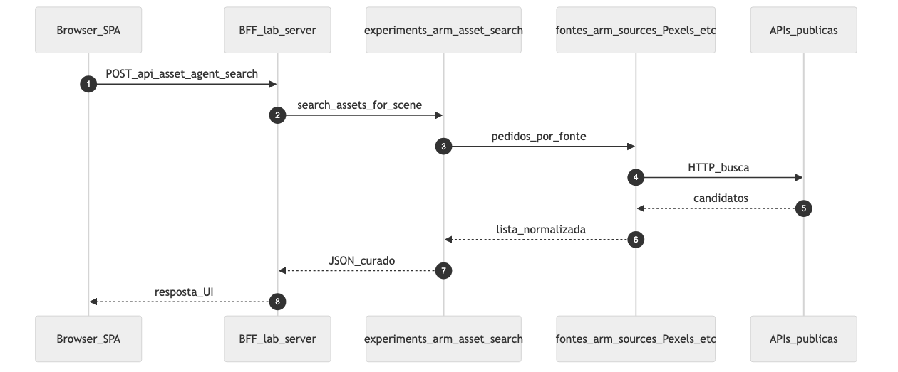
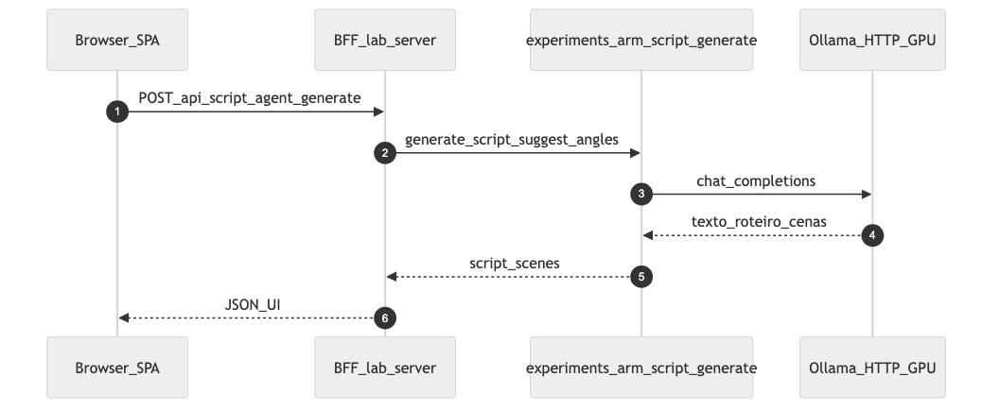

# Arquitetura do laboratório (workshop)

Este documento complementa [workshop/README.md](../README.md): explica **camadas lógicas** (pacotes Python e responsabilidades) e **camadas físicas** (referência homelab), para apresentação ao público **sem** depender de renomear pastas no código.

## 1. Camadas lógicas (módulos)

| Pacote / pasta | Papel | Notas |
|----------------|-------|--------|
| `workshop/web/` | SPA estática (HTML/CSS/JS) | Consome o BFF via `web/js/services.js`. |
| `workshop/bff/` | FastAPI: rotas `/api/*`, ficheiros estáticos, `/health`, OpenAPI | Processo HTTP único do laboratório. |
| `workshop/backend/` | **Pipeline de produção (workshop):** `VideoState`, `LLMGateway`, `core/pipeline.py` (LangGraph), agentes CPU | É aqui que está o grafo e os nós `research_agent` … `publisher_agent` (incl. `thumbnail_card_agent`). |
| `workshop/gpu/` | Agentes **GPU**: `visual_agent`, `composer_agent`, cliente ComfyUI | Chamados pelo grafo e pelos wrappers em `arm/` quando o lab gera clipes/vídeo. |
| `workshop/arm/` | **Laboratório:** fluxos e funções alinhadas aos nomes dos agentes (research pack, `search` por cena, `lab.py`, etc.) | **Não** significa “só corre em CPU ARM”: o nome espelha os agentes para o BFF. A implementação canónica dos nós está em `backend/` (+ `gpu/`). |

**Regra prática:** `backend` + `gpu` = **o que o LangGraph executa**; `arm` = **adaptadores e fluxos do lab** (UI, payloads, por vezes lógica paralela à produção); `bff` = **HTTP**; `web` = **browser**.

### Diagrama — visão lógica (pacotes)

Fontes editáveis: [diagrams/logical_layers.mmd](diagrams/logical_layers.mmd).



## 2. Camadas físicas (referência homelab)

Mapeamento **típico** (cluster Ideias Factory / documentação do projeto). O deploy real pode variar; o importante é a **rede** (Ollama/ComfyUI na GPU, NFS nos jobs, chaves de API).

| Tier | Nó / função | O que costuma correr |
|------|-------------|----------------------|
| Orquestração + I/O | Pi (ex.: `pi5-server-01`) | `scripts/run_pipeline.py`, agentes CPU em `workshop/backend/agents/`, opcionalmente o BFF. |
| GPU | `gpu-server-01` | Ollama (HTTP), ComfyUI, ffmpeg NVENC (`workshop/gpu/`). |
| Dados | NFS (`/mnt/nas/work/...`) | `job_path`, clips, `narration.wav`, `final.mp4`. |
| Serviços de apoio | `ideias-server` (exemplo) | PostgreSQL, métricas — **opcional** para o lab mínimo. |

### Diagrama — visão física (referência)

Fonte: [diagrams/physical_homelab.mmd](diagrams/physical_homelab.mmd).



## 3. Grafo LangGraph (ordem dos nós)

A ordem **exata** está em [workshop/backend/core/pipeline.py](../backend/core/pipeline.py). Resumo:

`research_agent` → `script_agent` → `asset_agent` → `visual_agent` → `tts_agent` → `composer_agent` → `metadata_agent` → `thumbnail_card_agent` → `publisher_agent` → `END`.

### Diagrama — ordem do pipeline

Fonte: [diagrams/pipeline_langgraph_order.mmd](diagrams/pipeline_langgraph_order.mmd).



**Relação com a UI:** a aba **Fluxo** do laboratório (`workshop/web/index.html`) mostra o mesmo pipeline em **SVG** interativo (tooltips por nó). Use esta página no browser e este PNG/slides para apresentação.

## 4. Diagramas de sequência

### 4.1 `invoke` do grafo (CLI / orquestração)

Visão **condensada**: um participante agrega os nós CPU e outro os GPU; mostra dependências HTTP típicas.

Fonte: [diagrams/sequence_pipeline_invoke.mmd](diagrams/sequence_pipeline_invoke.mmd).



### 4.2 Laboratório: pesquisa de assets (BFF → `arm`)

Exemplo de pedido **HTTP** que **não** passa pelo LangGraph completo: o browser chama o BFF, que usa `workshop.arm.asset_agent.search`.

Fonte: [diagrams/sequence_lab_bff_asset.mmd](diagrams/sequence_lab_bff_asset.mmd).



### 4.3 Laboratório: geração de roteiro (BFF → `arm` → Ollama)

Fonte: [diagrams/sequence_lab_bff_script.mmd](diagrams/sequence_lab_bff_script.mmd).



## 5. Regenerar imagens a partir dos `.mmd`

Na pasta [diagrams/](diagrams/):

```bash
npx --yes @mermaid-js/mermaid-cli@11.4.0 -i logical_layers.mmd -o logical_layers.png -w 2000 -H 1400 -b white
```

Ajuste `-w`/`-H` conforme o slide ou documento final.

## 6. Leituras relacionadas

- [workshop/backend/ARCHITECTURE_MAP.md](../backend/ARCHITECTURE_MAP.md) — mapa de origem monorepo → `workshop/backend` / `workshop/gpu`.
- [workshop/README.md](../README.md) — como correr, deploy (visão geral), configuração.
- [CONFIGURATION.md](CONFIGURATION.md) — variáveis de ambiente e paths do pacote `workshop/`; guia completo na raiz em [`../../docs/CONFIGURATION.md`](../../docs/CONFIGURATION.md).
- [ARQUITETURA_ADRS.md](ARQUITETURA_ADRS.md) — **ADRs** (cópia workshop); canónico: [../../docs/ARQUITETURA_ADRS.md](../../docs/ARQUITETURA_ADRS.md).
